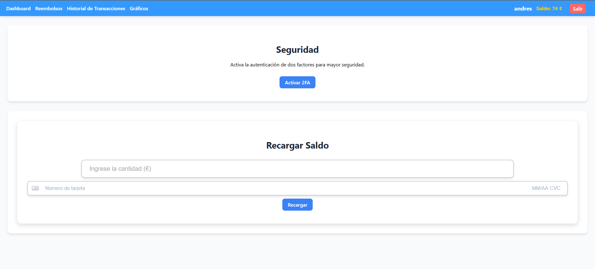

# Stripe App

## Projecto para integración de Stripe como pasarela de pago

Este projecto es una demo que se engloba en las tareas de Formación en centros de trabajo FCT y permite la integración completamente funcional de Stripe en un proyecto React y Laravel. La aplicación permite a los usuarios registrarse, iniciar sesión, recargar saldo, solicitar reembolsos y consultar su saldo y transacciones.
La aplicación también incluye autenticación de dos factores (2FA) para mayor seguridad y utiliza JWT para la autenticación de usuarios. Además, se utilizan librerías como Axios para las peticiones HTTP, React Router para la navegación y NIVO para la visualización de gráficos.

## Requisitos

- Tecnologías: React para el frontend y Laravel para el backend
- Base de datos: MySQL
- Estilos: Styles-Components para reusabilidad
- Librerías: Axios para las peticiones HTTP, React Router para la navegación y NIVO para la visualización de gráficos
- Autenticación: JWT para la autenticación de usuarios
- Autenticación de dos factores (2FA) para mayor seguridad
- Stripe: Integración de la API de Stripe para la gestión de pagos y transacciones
- Typescript: Uso de Typescript para la tipificación estática y la mejora de la calidad del código
- Docker: Uso de Docker para la creación de contenedores y la gestión del entorno de desarrollo
- Postman: Uso de Postman para la gestión de las peticiones HTTP y la prueba de la API

## Funcionalidad

- Registro de usuario
- Login de usuario
- Uso de 2FA para la seguridad
- Recarga de saldo
- Reembolso de saldo
- Consulta de saldo
- Consulta de transacciones, recargas y reembolsos
- Visualización de gráficos con estatísticas de transacciones

## Imagen de la app

